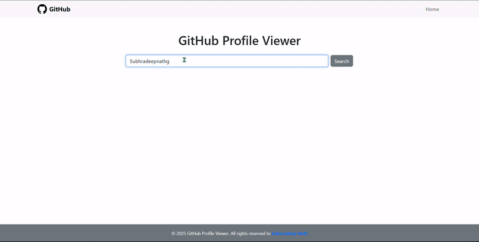

<h1 align="center"> GitHub Profile Viewer</h1>

<p align="center">
  
</p>


## 📌 Application Overview

**GitHub Profile Viewer** is a sleek, beginner-friendly web application that allows users to search and view GitHub user profiles by simply entering a username.  
It features a **clean and responsive interface** powered by:

-  **GitHub REST API**
-  **Axios**
-  **React**
-  **CSS**
-  **React-Bootstrap**

This project showcases the integration of a third-party API in a React app using secure token-based access with `.env` support.


## 🧩 Features

- 🔍 Fetch GitHub user data in real-time
- 🎯 Simple, smooth, and intuitive user interface
- 🔐 Secure GitHub Token integration using environment variables
- 💡 Built with React Js and GitHub REST API

##  User Interface

<div align="center" style="display: flex; justify-content: center; gap: 20px; flex-wrap: wrap;">
  
  
</div>


## 🔧 Tech Stack
<div align="left" style="display: flex; flex-wrap: wrap; gap: 20px;">
 
 
 
 
 
 
 

</div>
<br/>

## ⚙️ Getting Started

A smooth, minimal interface app that fetches GitHub profiles using the GitHub REST API. Built with **React**, **Axios**, **React-Bootstrap**, and **Vite**.


### 🛠️ Prerequisites

Make sure you have the following installed:

- [Node.js](https://nodejs.org/) (v16 or later)
- [npm](https://www.npmjs.com/) o
- [Git](https://git-scm.com/)
- GitHub **Personal Access Token** (with `public_repo` access)  
  _Generate from: https://github.com/settings/tokens_


### 🚀 Installation

```bash
git clone https://github.com/your-username/github-profile-viewer.git
cd github-profile-viewer
npm install
```


### ▶️ Run Locally

Start the development server:

```bash
npm run dev
```

Visit: [http://localhost:5173](http://localhost:5173)


## ⚙️ Environment Setup

Create a `.env` file in the root directory and add your GitHub token:

```env
VITE_GITHUB_TOKEN=your_personal_access_token
```

> ✅ **Note:** The `.env` file is ignored in `.gitignore` to protect your credentials.

### 🔐 Create `axiosinstance.js`

Since the token is securely stored in `.env`, you must create this file manually:

**Path:** `src/API/axiosinstance.js`

```js
import axios from "axios";

const token = import.meta.env.VITE_GITHUB_TOKEN;

const axiosInstance = axios.create({
  baseURL: "https://api.github.com",
  headers: {
    Authorization: `token ${token}`,
  },
});

export default axiosInstance;
```

> ⚠️ This file is intentionally not included in version control. Please create it locally to ensure the app runs properly.

---

### 🧪 Usage Guide

1. Type a **GitHub username** into the input field.
2. Click on **Search** to view public profile data.
3. Displays:
   - Avatar, bio, and follower info
   - Public repositories with stars, forks, etc.
   - Profile links and GitHub stats

---

### 📦 Production Build

To create an optimized production build:

```bash
npm run build
```

To preview the build locally:

```bash
npm run preview
```

---

### 🤝 Contributing

1. Fork this repository
2. Create a new branch: `git checkout -b feature-name`
3. Commit your changes: `git commit -m "Add some feature"`
4. Push to the branch: `git push origin feature-name`
5. Create a pull request 🚀

## 📜 License
This project is licensed under the [MIT License](LICENSE).

## 🙋‍♂️ Author
Made by [Subhradeep Nath](https://github.com/SubhradeepNathGit)

## 📬 Contact
Have any feedback or suggestions?

- 📧 Email: subhradeepnathprofessional@gmail.com
- 💼 LinkedIn: [Subhradeep Nath](https://linkedin.com/in/subhradeep-nath-dev)


## 🌟 Show Your Support
If you like this project, please consider:
- ⭐ Starring the repo
- 🍴 Forking to contribute
- 📣 Sharing with others


## 🙏 Acknowledgements

Thanks to:

- GitHub REST API Docs
- React Community
- Vite and Axios teams

---

> _“Code is like humor. When you have to explain it, it’s bad.” — Cory House_

